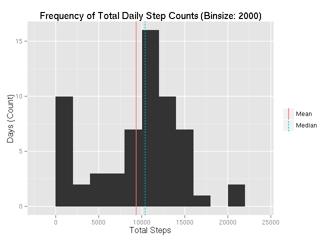
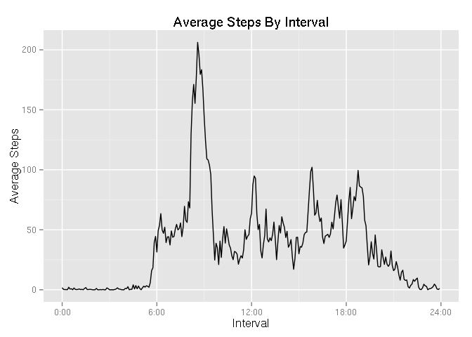
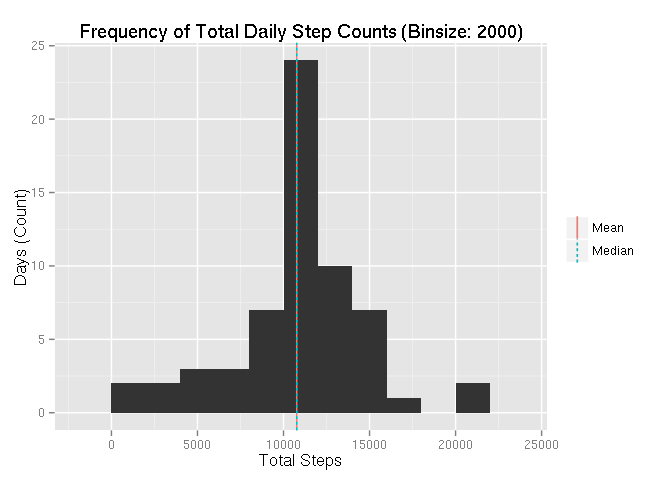
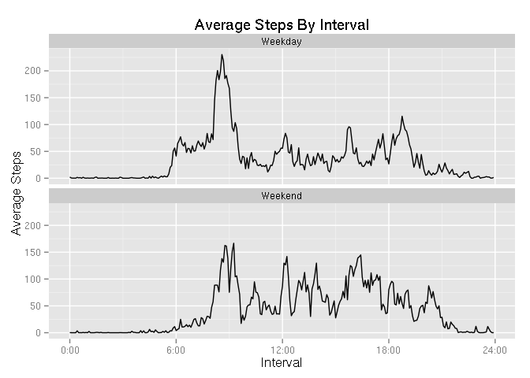

# Reproducible Research: Peer Assessment 1
Geoffrey Esposito  
07/13/2015  

First, set some options.

```r
  require(knitr)
  opts_chunk$set(echo = TRUE, cache = TRUE, cache.path = "cache/", fig.path = "figure/")
```

## Loading and preprocessing the data
First, the data is read in from the provided CSV file. 

```r
  unzip("activity.zip")
  data <- read.csv("activity.csv", colClasses=c("numeric","Date","numeric"))
  summary(data)
```

```
##      steps             date               interval     
##  Min.   :  0.00   Min.   :2012-10-01   Min.   :   0.0  
##  1st Qu.:  0.00   1st Qu.:2012-10-16   1st Qu.: 588.8  
##  Median :  0.00   Median :2012-10-31   Median :1177.5  
##  Mean   : 37.38   Mean   :2012-10-31   Mean   :1177.5  
##  3rd Qu.: 12.00   3rd Qu.:2012-11-15   3rd Qu.:1766.2  
##  Max.   :806.00   Max.   :2012-11-30   Max.   :2355.0  
##  NA's   :2304
```
However, the data has a small problem. The interval data looks numeric but it isn't exactly. The data is actually a numeric version of the timestamp in the format "HHMM" interpreted as an integer, which causes some problems. For example, interval 50 and 55 are 5 minutes apart and 5 apart numerically. However, interval 55 and 100 are also 5 minutes apart but 45 apart numerically. Thus we have to add another column to the data to reflect the "true" time in a numerically consistent manner. The "minutes_since_midnight" column will do just that. We also declare a function to convert it back to a human readable string, which will be useful for later.


```r
  time <- sprintf("%04d", data$interval)
  data$minutes_since_midnight <- (60 * as.numeric(substr(time, 1, 2))) + (as.numeric(substr(time, 3, 4)))
  minutes_to_time <- function(x) paste(x%/%60, sprintf("%02d",x%%60), sep=":")
```

## What is mean total number of steps taken per day?
For the initial measurements, NA values are simply ignored.

```r
  library(ggplot2)
  total_steps_by_date <- aggregate(steps ~ date, data, FUN=sum, na.rm=TRUE, na.action=na.pass)
  mean_steps <- mean(total_steps_by_date$steps)
  median_steps <- median(total_steps_by_date$steps)
  ggplot(total_steps_by_date, aes(x=steps)) + geom_histogram(binwidth=2000) +
  geom_vline(aes(xintercept=mean_steps, color="Mean", linetype="Mean"), show_guide=TRUE) +
  geom_vline(aes(xintercept=median_steps, color="Median", linetype="Median"), show_guide=TRUE) +
  labs(x="Total Steps", y = "Days (Count)", title="Frequency of Total Daily Step Counts (Binsize: 2000)") +
  theme(legend.title=element_blank())
```

 

The mean number of steps taken per day is **9354**.  
The median number of steps taken per day is **10395**.

## What is the average daily activity pattern?

```r
  mean_steps_by_interval <- aggregate(steps ~ interval, data, FUN=mean, na.rm=TRUE, na.action=na.pass)
  max_interval <- mean_steps_by_interval[which.max(mean_steps_by_interval$steps), 'interval']
  # Convert the interval "number" to print it nicely as a time
  max_interval <- sprintf("%04d", max_interval)
  max_interval <- paste(as.numeric(substr(max_interval, 1, 2)), substr(max_interval, 3, 4), sep=":")

  ggplot(data, aes(x=minutes_since_midnight, y=steps)) + stat_summary(fun.y="mean", geom="line", na.rm=TRUE) +
  scale_x_continuous(labels=minutes_to_time, breaks=c(0, 360, 720, 1080, 1440)) +
  labs(x="Interval", y="Average Steps", title="Average Steps By Interval")
```

 

The interval with the highest mean stepcount is  **8:35**.  

## Imputing missing values

```r
  missing_count <- sum(is.na(data))
```
Unfortunately the data is missing quite a few values, **2304** to be exact.

Missing data is filled in by taking the average for that interval accross days. This seems more appropriate than taking the average for the day as the
average steps taken at different intervals varies by multiple orders of magnitude.


```r
  filled <- data
  mean_steps_by_interval_filled <- aggregate(steps ~ interval, filled, FUN=mean, na.rm=TRUE, na.action=na.pass)
  filled$steps <- as.numeric(apply(filled, 1, function(row){
    if(is.na(row['steps'])){
      row['steps'] <- mean_steps_by_interval_filled[mean_steps_by_interval_filled$interval == as.numeric(row['interval']),]$steps
    } else {
      row['steps']
    }
  }))
```
After adding the missing data, repeating the earlier analysis gives a new graph along with new mean and median steps per day.


```r
  total_steps_by_date_filled <- aggregate(steps ~ date, filled, FUN=sum, na.rm=TRUE, na.action=na.pass)
  mean_steps_filled <- mean(total_steps_by_date_filled$steps)
  median_steps_filled <- median(total_steps_by_date_filled$steps)
  ggplot(total_steps_by_date_filled, aes(x=steps)) + geom_histogram(binwidth=2000) +
  geom_vline(aes(xintercept=mean_steps_filled, color="Mean", linetype="Mean"), show_guide=TRUE) +
  geom_vline(aes(xintercept=median_steps_filled, color="Median", linetype="Median"), show_guide=TRUE) +
  labs(x="Total Steps", y = "Days (Count)", title="Frequency of Total Daily Step Counts (Binsize: 2000)") +
  theme(legend.title=element_blank())
```

 

The mean and median steps taken per day changes as a result and the mean and median in the new data set are the same, which is unsuprising as replacing missing days of data with mean values inflates the frequency of the average case.

The new mean number of steps taken per day is **10766**.  
The new median number of steps taken per day is **10766**.

## Are there differences in activity patterns between weekdays and weekends?
To calculate this, a new column must first be added to the filled data set to indicate wether a record corresponds to a weekday or not.

```r
  filled$weekend <- as.factor(sapply(weekdays(data$date), function(day){
    if(day == "Saturday" || day == "Sunday"){
      "Weekend"
    }else{
      "Weekday"
    }
  }, USE.NAMES = FALSE))
```

Then the data is graphed seperately for weekdays and weekends.

```r
  ggplot(filled, aes(x=minutes_since_midnight, y=steps)) + stat_summary(fun.y="mean", geom="line", na.rm=TRUE) +
  facet_wrap(~weekend, ncol = 1) +
  scale_x_continuous(labels=minutes_to_time, breaks=c(0, 360, 720, 1080, 1440)) +
  labs(x="Interval", y="Average Steps", title="Average Steps By Interval")
```

 

Unsuprisingly the weekday data has more spikes to it due to the timing of the workday while weekend data is generally more consistent throughout the day.
